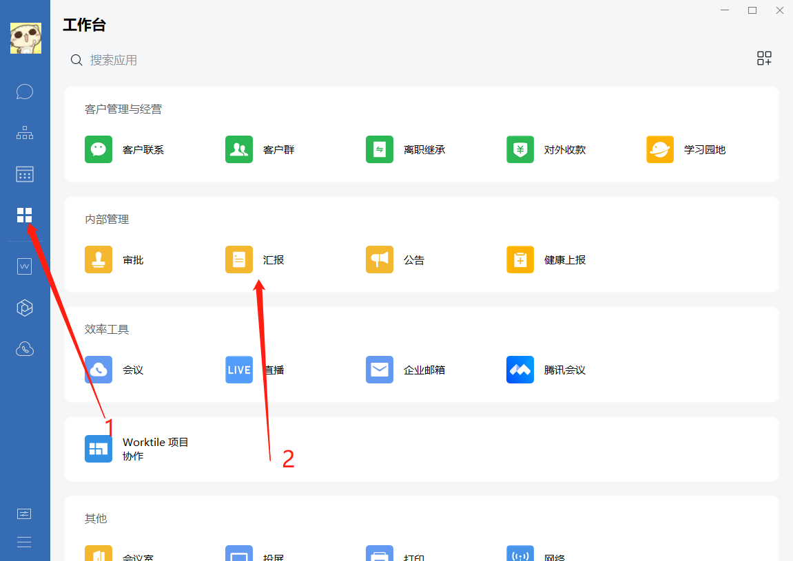
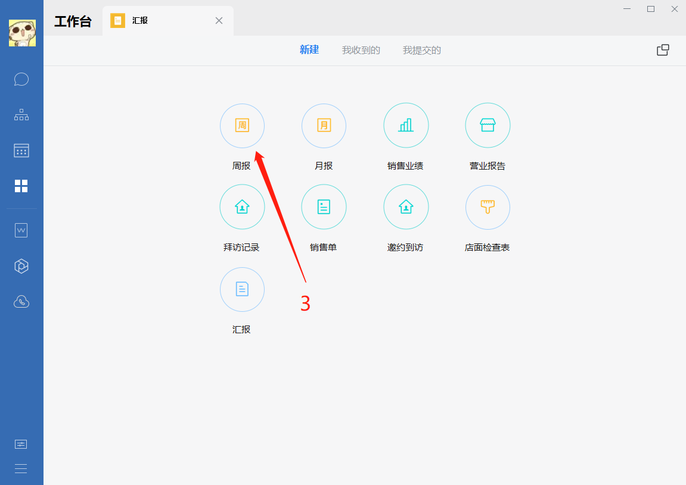
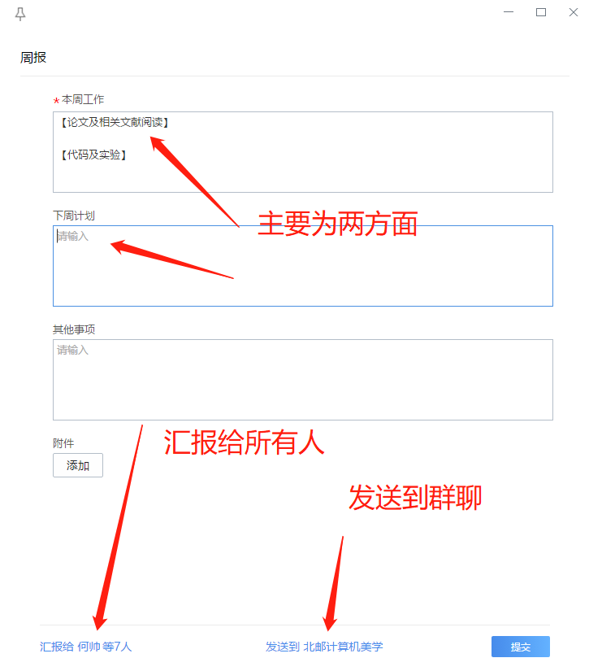

实验室内部美学课题组入门学习材料
===============================

前言：为了帮助已经加入、有意向加入我们美学组的同学，更快的融入课题，找到属于自己的研究方向，特拟该资料。如你现在尚未确定是否加入我们美学组，可以先看第三部分的调研报告和计算机美学的发展，初步了解美学相关的概念。

## 项目组成员

| 方向       | 描述     | 可能技术 | 目前人员     |
| :-----------: | :--------: | :--------: | :--------: |
| 图像整体美学评估    |    对图像整体美感进行评分，属于基础研究    |     图像处理、自监督学习、多任务等     |      何帅（博士生），刘立敏&谢睿（组内本科生），李珺玥&王乾凱&孙津硕（组外本科生）     |
| 对焦评估    |    对图像对焦进行评分，能用于智能对焦    |     图像处理、显著性检测等     |      张永昌（博士生）     |
| 构图评估    |    对图像构图进行评分，能用于自动裁剪和构图    |     图像处理、图像增强、显著性检测等     |      高有江（硕士生）     |
| 色彩评估    |    对图像色彩进行评分，评估色彩的和谐性    |     图像处理、多任务等     |      李嘉龙（硕士生）     |
| 曝光评估    |    对图像曝光进行评分，能用于曝光纠正    |     图像处理、GAN等     |      张志宇（硕士生）     |
| 噪声评估    |    对图像噪声进行评分，能用于去噪    |     图像处理、去噪、自监督等     |      肖鹏翔（硕士生）     |
| 伪像评估    |    对图像伪像进行评分   |     图像处理、图像增强等     |      衡德康（硕士生）     |
| 清晰度评估    |    对图像清晰度进行评分   |     图像处理、图像增强等     |      姜东翔（硕士生）     |

## 入门文章
+ "*图像美学质量评价调研报告.*" 知乎 [[link]](https://zhuanlan.zhihu.com/p/37307679)
+ "*这些年，计算机美学的发展.*" 知乎 [[link]](https://zhuanlan.zhihu.com/p/91516029)
+ Naila Murray, Luca Marchesotti, Florent Perronnin: "*AVA: A large-scale database for aesthetic visual analysis.*" CVPR (2012) [[pdf]](https://ieeexplore.ieee.org/stamp/stamp.jsp?tp=&arnumber=6247954)
+ Hossein Talebi and Peyman Milanfar: "*NIMA: Neural image assessment.*" TIP (2018) [[pdf]](https://ieeexplore.ieee.org/abstract/document/8352823) [[code]](https://paperswithcode.com/paper/nima-neural-image-assessment#code)
+ Aydın, Tunç Ozan, Aljoscha Smolic, and Markus Gross: "*Automated aesthetic analysis of photographic images.*" IEEE T VIS COMPUT GR (2014) [[pdf]](http://citeseerx.ist.psu.edu/viewdoc/download?doi=10.1.1.675.3491&rep=rep1&type=pdf).

## 深度学习基础知识
### 理论知识
+ "*李宏毅机器学习课程.*" 哔哩哔哩 [[link]](https://www.bilibili.com/video/BV1JE411g7XF?from=search&seid=16114573361443816126)
### 动手实践
+ "*动手学深度学习(PyTorch版).*" GitHub [[link]](https://tangshusen.me/Dive-into-DL-PyTorch/#/)
+ "*深度学习框架PyTorch：入门与实践.*" GitHub [[link]](https://github.com/chenyuntc/pytorch-book)

### 其它工具
+ "*Mendeley.*" 论文整理工具 [[link]](https://zhuanlan.zhihu.com/p/28762628)
+ "*connectedpapers.*" 论文追溯工具 [[link]](https://www.connectedpapers.com/)
+ "*Paperswithcode.*" 论文代码查找工具 [[link]](https://paperswithcode.com/)
+ "*Google colab.*" 免费GPU平台，如额外需服务器资源，请联系我本人 [[link]](https://colab.research.google.com/notebooks/intro.ipynb)

### 可选
如你希望与我们的交流更紧密，请加入我们内部的企业微信，每周提交一次周报，企业微信【邀请码】可以联系我本人获取，提交周报流程如下：

